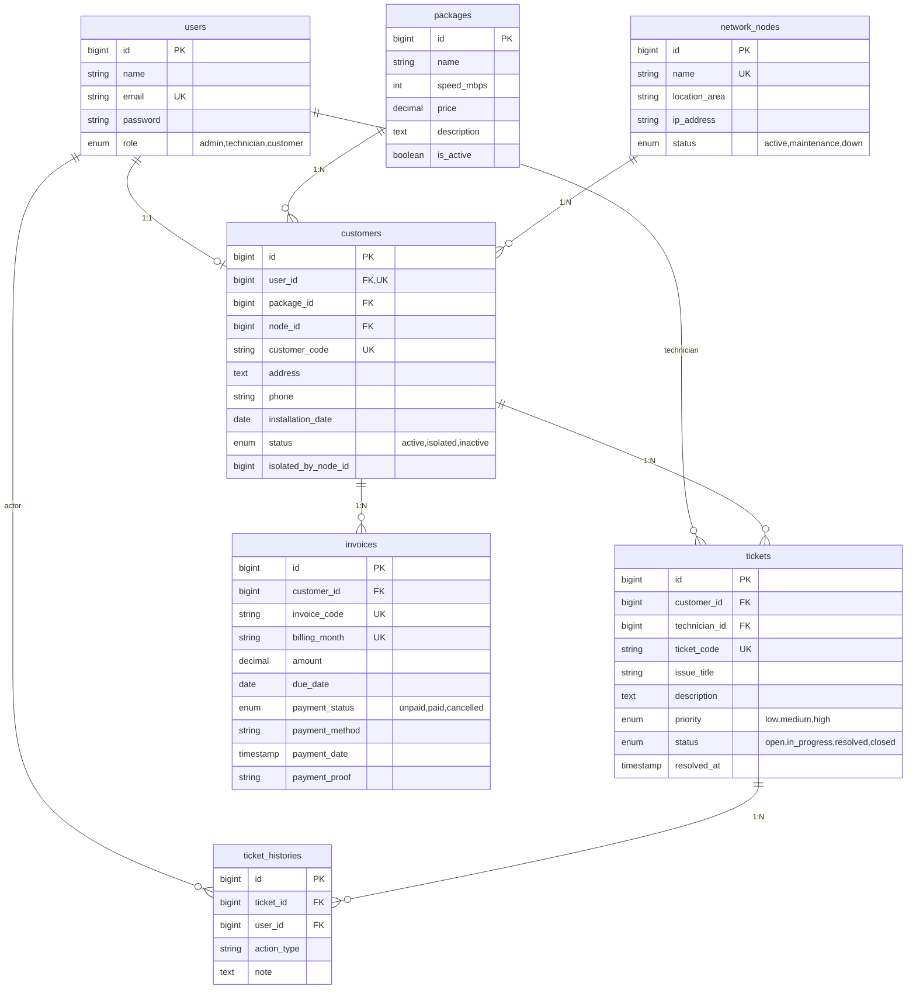

# Product Requirement Document (PRD)

**Nama Produk:** NetInfo (Network Information & Operation Management System)  
**Judul Proyek:** Rancang Bangun Sistem Informasi Manajemen Operasional Jaringan, Layanan Gangguan (*Trouble Ticketing*), dan *Billing* Pelanggan Berbasis Web Menggunakan Framework Laravel  
**Versi Dokumen:** 1.1
**Target Platform:** Web Desktop & Mobile-Responsive  

---

## 1. Ringkasan Eksekutif & Latar Belakang (Executive Summary)
Pengelolaan operasional pada penyedia layanan internet skala lokal (ISP/RT-RW Net/NOC instansi) kerap menghadapi kendala efisiensi akibat pencatatan data yang terfragmentasi. Pelaporan gangguan via pesan pribadi rentan terabaikan tanpa riwayat penanganan yang jelas, validasi pembayaran tagihan bulanan memakan waktu, dan data persebaran pelanggan pada titik distribusi jaringan (*Optical Distribution Point* / ODP) sulit dipantau secara real-time.

**NetInfo** hadir sebagai solusi sistem informasi manajemen terpadu berbasis web yang mengintegrasikan tiga pilar utama:
1. **Trouble Ticketing Lifecycle:** Pelacakan siklus hidup penanganan komplain gangguan dari pelaporan mandiri pelanggan (*Helpcare*), disposisi teknisi oleh Admin NOC, hingga pencatatan log solusi teknis di lapangan.
2. **Automated Billing Management & Individual Invoicing:** Pembangkitan invoice bulanan terstruktur, portal pembayaran multi-metode (Transfer Bank SeaBank & QRIS Dinamis), verifikasi bukti pembayaran manual, isolasi pelanggan menunggak, dan pencetakan faktur resmi individual per transaksi.
3. **Network Node Mapping:** Manajemen keterhubungan pelanggan dengan perangkat distribusi jaringan ODP beserta pemantauan status operasional dan alamat IP manajemen.

---

## 2. Sasaran Pengguna & Matriks Hak Akses (User Personas & RBAC)

| Peran (Role) | Hak Akses & Tanggung Jawab Utama |
|---|---|
| **Administrator (NOC / Billing)** | Akses penuh (Full CRUD) paket layanan, titik ODP, data pelanggan, penugasan teknisi, verifikasi bukti bayar (Approve/Reject), eksekusi isolir & pemulihan pelanggan, generate tagihan, dan ekspor laporan. |
| **Teknisi Lapangan (Technician)** | Ringkasan tugas teknisi, akses penuh pengelolaan titik ODP (*Network Nodes*), menangani tiket yang ditugaskan (*Work Orders*), menginput log teknis penanganan, dan mengubah status tiket ke `resolved`. **Read-Only** pada data pelanggan dan **DIBLOKIR TOTAL** dari modul Billing. |
| **Pelanggan (Customer)** | Portal mandiri sederhana: melihat ringkasan paket aktif, status koneksi, portal Helpcare (lapor gangguan & lacak status), melihat riwayat tagihan, melakukan pembayaran (SeaBank/QRIS), mengunggah bukti bayar, dan mencetak faktur lunas individual. |

---

## 3. Kebutuhan Fungsional (Functional Requirements)

### Modul A: Otentikasi & Otorisasi
* **`FR-AUTH-01`**: Sistem mengautentikasi pengguna menggunakan email dan password terenkripsi (Bcrypt) berbasis tabel `users`.
* **`FR-AUTH-02`**: Sistem memberikan notifikasi peringatan jika kredensial email/kata sandi salah atau tidak terdaftar.
* **`FR-AUTH-03`**: Sistem membatasi hak akses halaman menggunakan Middleware berbasis Role (`admin`, `technician`, `customer`).
* **`FR-AUTH-04`**: Setiap pengguna dapat mengelola data profil mandiri dan memperbarui kata sandi melalui menu Profil Saya (menu pengaturan redundan ditiadakan).

### Modul B: Manajemen Data Master & Infrastruktur Jaringan
* **`FR-MST-01`**: Administrator dapat mengelola (CRUD) data paket internet (nama paket, kecepatan, tarif bulanan, deskripsi).
* **`FR-MST-02`**: Administrator dapat mengelola penuh (CRUD) titik *Network Node* / ODP; Teknisi dapat menambah dan memperbarui data ODP. Data meliputi nama/kode node unik, lokasi wilayah, alamat IP manajemen, dan status operasional: *active/maintenance/down*.
* **`FR-MST-03`**: Administrator dapat mengelola (CRUD) data pelanggan (kode pelanggan otomatis `CUST-YYYYMM-XXXX`, penetapan paket, penentuan ODP terhubung, alamat, kontak, dan status: *active/isolated/inactive*). Penambahan pelanggan baru otomatis membuatkan akun login di tabel `users`.
* **`FR-MST-04`**: Administrator dapat melakukan isolir layanan pelanggan (`active` $\rightarrow$ `isolated`) dan melakukan pemulihan kembali (`isolated` $\rightarrow$ `active`).

### Modul C: Layanan Gangguan (*Trouble Ticketing / Helpcare*)
* **`FR-TCK-01`**: Pelanggan dapat membuat tiket gangguan baru via menu Helpcare dengan kode tiket otomatis (`TICK-YYYYMMDD-XXXX`), memilih tingkat prioritas (*Low/Medium/High*), dan mendeskripsikan kendala.
* **`FR-TCK-02`**: Tiket yang dibuat pelanggan langsung terhubung dan memicu notifikasi di antrean tiket panel Administrator dan Teknisi.
* **`FR-TCK-03`**: Administrator dapat memeriksa daftar antrean tiket masuk dan mendisposisikan (*assign*) teknisi lapangan yang bertanggung jawab.
* **`FR-TCK-04`**: Teknisi hanya dapat melihat antrean tiket yang ditugaskan kepada dirinya, memasukkan catatan/log solusi teknis, dan memperbarui status pengerjaan (`in_progress` $\rightarrow$ `resolved`).
* **`FR-TCK-05`**: Sistem secara otomatis merekam setiap mutasi status dan interaksi ke dalam tabel audit `ticket_histories`.

### Modul D: Penagihan, Pembayaran & Faktur (*Billing*)
* **`FR-BIL-01`**: Administrator dapat membangkitkan invoice bulanan (`INV-YYYYMM-XXXX`) secara massal maupun individual untuk pelanggan aktif.
* **`FR-BIL-02`**: Pelanggan dapat membuka modal pembayaran interaktif dengan 2 opsi metode:
  * **Transfer Bank:** Menampilkan nomor rekening SeaBank (`9981237810913` a.n. Muhammad Ridha Rezeki) dengan fitur salin nomor rekening.
  * **QRIS Dinamis:** Menampilkan gambar kode QRIS dari aset sistem (`public/images/qris.jpg`).
* **`FR-BIL-03`**: Pelanggan dapat mengunggah berkas bukti pembayaran (`.jpg`, `.jpeg`, `.png`, `.pdf`) bersama pilihan metode pembayaran (`SeaBank Transfer` atau `QRIS`) yang disimpan ke kolom `payment_method`.
* **`FR-BIL-04`**: Administrator memvalidasi bukti pembayaran terlampir; jika disetujui (*Approve*), status tagihan berubah menjadi `paid` dan tanggal pembayaran tercatat. Jika ditolak (*Reject*), kolom `payment_proof` dan `payment_method` dikosongkan agar pelanggan dapat mengunggah ulang.
* **`FR-BIL-05`**: Sistem menyediakan fitur cetak faktur/struk resmi individual (`GET /invoices/{id}/print`) format A4 siap cetak (`@media print`) yang memuat rincian invoice, identitas pelanggan, detail ODP, nominal paket, dan stempel status **LUNAS / PAID**.
* **`FR-BIL-06`**: Sistem menyediakan fitur ekspor rekapitulasi billing ke format CSV (`GET /admin/invoices/export`) dengan filter periode bulan dan status pembayaran.

---

## 4. Kebutuhan Non-Fungsional (Non-Functional Requirements)

* **Keamanan (Security):**
  * Hashing password menggunakan algoritma Bcrypt standar Laravel.
  * Perlindungan terhadap Cross-Site Request Forgery (CSRF) pada seluruh form.
  * Perlindungan terhadap SQL Injection melalui Eloquent ORM & Parameterized Queries.
  * Pengamanan berkas unggahan bukti bayar dengan validasi tipe MIME dan ukuran maksimum file.
* **Kinerja (Performance):**
  * Waktu render halaman rata-rata $\le 2$ detik pada koneksi internet standar.
  * Optimasi relasi database menggunakan *Eager Loading* untuk mencegah isu $N+1$ query.
* **Usabilitas & Antarmuka:**
  * Antarmuka responsif pada resolusi desktop maupun perangkat mobile dengan styling Tailwind CSS (CDN).
  * Menyediakan umpan balik visual (*Flash Message / Toast Notification*) pada setiap aksi mutasi data.
  * Standarisasi indikator warna status: Hijau (Active/Paid), Kuning (Maintenance/Pending), Merah (Down/Isolated/Unpaid).

---

## 5. Arsitektur Basis Data (Entity Relationship)

---

## 6. Kamus Data (Data Dictionary)

| Nama Tabel | Nama Kolom | Tipe Data | Keterangan & Constraint |
|---|---|---|---|
| **`users`** | `id` | BIGINT (PK) | Auto increment |
| | `name` | VARCHAR(255) | Nama lengkap pengguna |
| | `email` | VARCHAR(255) | Unique, kredensial login |
| | `password` | VARCHAR(255) | Hash Bcrypt |
| | `role` | ENUM | `'admin'`, `'technician'`, `'customer'` |
| | `phone` | VARCHAR(20) | Nullable, nomor WhatsApp / telepon |
| **`internet_packages`** | `id` | BIGINT (PK) | Auto increment |
| | `name` | VARCHAR(100) | Nama paket (misal: "Home 20 Mbps") |
| | `speed` | VARCHAR(50) | Kecepatan bandwidth (misal: "20 Mbps") |
| | `price` | DECIMAL(12,2) | Tarif per bulan (misal: `250000.00`) |
| | `description`| TEXT | Nullable, detail benefit |
| **`network_nodes`** | `id` | BIGINT (PK) | Auto increment |
| | `node_code` | VARCHAR(50) | Unique, format: `ODP-LSM-001` |
| | `name` | VARCHAR(100) | Identitas titik ODP |
| | `location` | VARCHAR(255) | Alamat titik sebaran |
| | `ip_address` | VARCHAR(45) | Nullable, IP manajemen |
| | `capacity` | INT | Total kapasitas port |
| | `used_ports` | INT | Port yang terpakai |
| | `status` | ENUM | `'active'`, `'maintenance'`, `'down'` |
| **`customers`** | `id` | BIGINT (PK) | Auto increment |
| | `user_id` | BIGINT (FK, Unique) | Relasi 1:1 ke `users.id` (Cascade) |
| | `package_id` | BIGINT (FK) | Relasi ke `internet_packages.id` |
| | `node_id` | BIGINT (FK) | Relasi ke `network_nodes.id` |
| | `customer_code` | VARCHAR(30) | Unique, format: `CUST-YYYYMM-XXXX` |
| | `address` | TEXT | Alamat lengkap instalasi |
| | `phone` | VARCHAR(20) | Nomor WhatsApp/telepon (10-15 digit angka) |
| | `installation_date` | DATE | Tanggal pemasangan / aktivasi layanan |
| | `status` | ENUM | `'active'`, `'isolated'`, `'inactive'` |
| | `isolated_by_node_id` | BIGINT | Nullable, penanda isolasi otomatis oleh ODP |
| **`tickets`** | `id` | BIGINT (PK) | Auto increment |
| | `customer_id` | BIGINT (FK) | Relasi ke `customers.id` (Pelapor) |
| | `technician_id`| BIGINT (FK) | Nullable, relasi ke `users.id` (Teknisi tugas) |
| | `ticket_code` | VARCHAR(30) | Unique, format: `TICK-YYYYMMDD-XXXX` |
| | `issue_title` | VARCHAR(255) | Subjek keluhan kendala |
| | `description` | TEXT | Kronologi / detail kerusakan |
| | `priority` | ENUM | `'low'`, `'medium'`, `'high'` |
| | `status` | ENUM | `'open'`, `'in_progress'`, `'resolved'`, `'closed'` |
| | `resolved_at` | TIMESTAMP | Nullable, waktu tuntas penanganan |
| **`ticket_histories`** | `id` | BIGINT (PK) | Auto increment |
| | `ticket_id` | BIGINT (FK) | Relasi ke `tickets.id` (Cascade) |
| | `user_id` | BIGINT (FK) | Relasi ke `users.id` (Pelaku aksi) |
| | `action_type` | VARCHAR(50) | Tipe aksi: `created`, `assigned`, `status_changed`, `note_added` |
| | `note` | TEXT | Catatan log pengerjaan teknis |
| **`invoices`** | `id` | BIGINT (PK) | Auto increment |
| | `customer_id` | BIGINT (FK) | Relasi ke `customers.id` |
| | `invoice_code` | VARCHAR(30) | Unique, format: `INV-YYYYMM-XXXX` |
| | `amount` | DECIMAL(12,2) | Nominal tagihan |
| | `billing_month`| VARCHAR(7) | Periode tagihan, format `YYYY-MM` (misal: "2026-08") |
| | `due_date` | DATE | Tanggal jatuh tempo tagihan (tanggal 25) |
| | `payment_status` | ENUM | `'unpaid'`, `'paid'`, `'cancelled'` |
| | `payment_method`| VARCHAR(50) | Nullable (`'SeaBank Transfer'`, `'QRIS'`) |
| | `payment_proof`| VARCHAR(255)| Nullable, path berkas bukti transfer |
| | `payment_date` | TIMESTAMP | Nullable, waktu verifikasi lunas |

---

## 7. Spesifikasi Teknologi (Tech Stack)

* **Backend Framework:** PHP 8.2+, Laravel 11/12
* **Frontend:** Blade Templating Engine, Tailwind CSS (CDN), Vanilla JS / Alpine.js
* **Database:** MySQL / MariaDB (InnoDB Engine dengan Relasi Foreign Key)
* **Pencetakan Dokumen:** View Standar A4 Ramah Media Cetak (`@media print` & `window.print()`) serta opsional library `barryvdh/laravel-dompdf`

---

## 8. Sprint Checklist & Task Breakdown

### Fase 1: Fondasi Proyek & Basis Data
- [x] Inisialisasi proyek Laravel dan konfigurasi koneksi database MySQL.
- [x] Buat file Migration (`users`, `internet_packages`, `network_nodes`, `customers`, `tickets`, `ticket_histories`, `invoices`).
- [x] Buat seluruh Model Eloquent beserta relasi relasionalnya.
- [x] Buat `DatabaseSeeder` berisi akun nyata multi-role (2 Admin, 2 Teknisi, 3–5 Pelanggan) dan master data node/paket.

### Fase 2: Autentikasi & RBAC
- [x] Implementasi sistem login dinamis dengan validasi kredensial.
- [x] Terapkan Role Middleware untuk memisahkan hak akses Admin, Teknisi, dan Client.
- [x] Sempurnakan menu Profil Saya dan hilangkan menu Pengaturan yang tidak terpakai.

### Fase 3: Modul Data Master & Jaringan
- [x] CRUD Data Master Paket Internet.
- [x] CRUD Titik ODP (*Network Nodes*) untuk Admin & Teknisi dengan filter status.
- [x] CRUD Data Pelanggan dengan aksi Isolir dan Pemulihan status layanan.

### Fase 4: Modul Trouble Ticketing
- [x] Form pelaporan tiket gangguan di panel Client (Helpcare).
- [x] Antrean tiket dan modal penugasan teknisi (*Assign Technician*) di panel Admin.
- [x] Workspace tiket teknisi untuk input solusi dan perubahan status ke `Resolved`.
- [x] Pencatatan audit trail otomatis di tabel `ticket_histories`.

### Fase 5: Modul Billing & Faktur Individual
- [x] Fitur generate tagihan bulanan untuk seluruh pelanggan aktif.
- [x] Modal pop-up pembayaran di dashboard client (Opsi SeaBank & QRIS).
- [x] Fitur unggah berkas bukti pembayaran oleh pelanggan.
- [x] Fitur verifikasi bukti bayar (Approve/Reject) oleh Admin.
- [x] Fitur cetak faktur resmi individual format A4 (`/invoices/{id}/print`).

### Fase 6: Penyusunan Dokumen Laporan Mini Skripsi
- [ ] **Bab 1:** Masukkan latar belakang, rumusan masalah, batasan, tujuan, dan manfaat sesuai PRD V2.
- [ ] **Bab 2:** Landasan teori (Konsep ISP, MVC Laravel, MySQL, Trouble Ticketing, Billing, Black Box).
- [ ] **Bab 3:** Diagram UML (Use Case, Activity, Sequence), Flowchart Tiket & Billing, dan ERD Kamus Data.
- [ ] **Bab 4:** Implementasi antarmuka dan tabel pengujian fungsional *Black Box Testing*.
- [ ] **Bab 5:** Penarikan kesimpulan dan saran pengembangan lanjutan.

### Fase 7: Fitur Tambahan & Perbaikan Berdasarkan BUG.md
- [x] **Modal pembayaran interaktif** di dashboard customer dengan 2 metode: SeaBank Transfer dan QRIS.
- [x] **Upload bukti pembayaran** oleh customer dengan validasi file dan pilihan metode.
- [x] **Verifikasi pembayaran** oleh admin (Approve/Reject) dengan reset data jika ditolak.
- [x] **Fitur isolir & pemulihan** pelanggan oleh admin dengan status perubahan (`active` ↔ `isolated`).
- [x] **Cascade isolation** saat status ODP berubah menjadi `maintenance` atau `down`.
- [x] **Cascade restoration** saat ODP kembali `active` hanya untuk pelanggan yang diisolir oleh sistem.
- [x] **Validasi nomor WA** (hanya angka, 10-15 digit) di semua form pelanggan.
- [x] **Toggle show/hide password** di halaman login dan profil.
- [x] **Perbaikan UI** ganti label "Customer" menjadi "User" di client dashboard.
- [x] **Fix semua fitur search, filter, dan CRUD** di semua modul.
- [x] **Fix bug parsing syntax** di view tickets/show.blade.php.
- [x] **Update profil UI** - hapus menu "Pengaturan", cukup "Profil Saya".
- [x] **Fix fitur ekspor** rekap tiket dan invoice ke CSV.
- [x] **Improve scroll UX** tabel responsif dengan `overflow-x-auto`.
- [x] **Fix prioritas color selection** di form helpcare customer.
- [x] **Fix status update** di riwayat penanganan tiket.