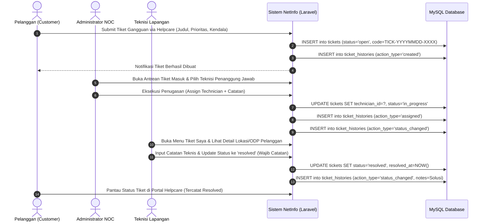
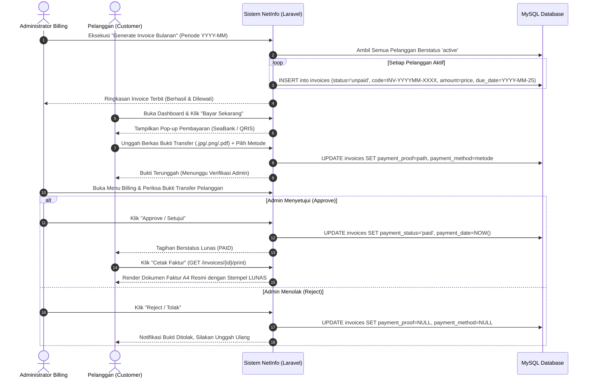

# Arsitektur Perangkat Lunak (Software Architecture Document)

**Nama Produk:** NetInfo (Network Information & Operation Management System)  
**Topik:** Rancang Bangun Sistem Informasi Manajemen Operasional Jaringan, Layanan Gangguan (*Trouble Ticketing*), dan *Billing* Pelanggan Berbasis Web Menggunakan Framework Laravel  
**Versi Dokumen:** 1.0 (Final Architecture Blueprint)  
**Target Platform:** Web Desktop & Mobile-Responsive  

---

## 1. Ringkasan Eksekutif & Visi Sistem

**NetInfo** adalah sistem informasi manajemen terpadu yang dirancang untuk penyedia layanan internet skala lokal (ISP, RT-RW Net, dan *Network Operation Center* / NOC instansi). Sistem ini mengintegrasikan tiga pilar operasional utama dalam satu platform terpusat:

1. **Trouble Ticketing Lifecycle (Helpcare):** Manajemen siklus hidup komplain gangguan jaringan dari pelaporan mandiri pelanggan, disposisi teknisi lapangan oleh Admin NOC, pencatatan log teknis perbaikan, hingga penyelesaian kendala dengan jejak audit (*audit trail*) otomatis.
2. **Automated Billing Management & Invoicing:** Pembangkitan invoice tagihan bulanan secara massal, integrasi gerbang pembayaran multi-metode (Transfer Bank SeaBank & QRIS Dinamis), portal unggah bukti bayar pelanggan, verifikasi admin (*Approve/Reject*), serta pencetakan faktur resmi individual standar A4 siap cetak (`@media print`).
3. **Network Node Infrastructure Mapping:** Pemetaan keterhubungan pelanggan ke titik distribusi jaringan (*Optical Distribution Point* / ODP), pemantauan status operasional node (*active, maintenance, down*), dan mekanisme otomatis *cascade isolation & restoration* bagi pelanggan terhubung.

---

## 2. Pola Arsitektur (Architectural Pattern)

NetInfo dibangun menggunakan arsitektur **Monolithic Model-View-Controller (MVC)** berbasis framework **Laravel 11/12**. Pola ini memisahkan logika aplikasi menjadi lapisan-lapisan yang terstruktur, modular, dan mudah dipelihara:

```
┌─────────────────────────────────────────────────────────────────────────┐
│                           CLIENT / BROWSER                              │
│         (HTML5, Blade Templates, Tailwind CSS CDN, Alpine.js / JS)      │
└────────────────────────────────────┬────────────────────────────────────┘
                                     │ HTTP/HTTPS Request
                                     ▼
┌─────────────────────────────────────────────────────────────────────────┐
│                      ROUTING & MIDDLEWARE LAYER                         │
│  - Web Routes (routes/web.php)                                          │
│  - Authentication Middleware (auth, guest)                              │
│  - Role-Based Access Control Middleware (RoleMiddleware: admin/tech/cust│
│  - Security Pipeline (CSRF Token, Session Regenerate)                   │
└────────────────────────────────────┬────────────────────────────────────┘
                                     │ Validated Request
                                     ▼
┌─────────────────────────────────────────────────────────────────────────┐
│                     CONTROLLER / APPLICATION LAYER                      │
│  - AuthController          - AdminController        - TechnicianCtrl    │
│  - CustomerController      - TicketController       - InvoiceController │
│  - NetworkNodeController   - SearchController                           │
└──────────────────┬──────────────────────────────────┬───────────────────┘
                   │                                  │
                   ▼                                  ▼
┌──────────────────────────────────────┐  ┌───────────────────────────────┐
│        SUPPORT & DOMAIN LOGIC        │  │   DATA PERSISTENCE (ELOQUENT) │
│  - App\Support\Codes (Code Generator)│  │  - User, Customer, Package    │
│  - DB Transactions (Atomic Operations│  │  - NetworkNode, Ticket        │
│  - File Storage Management (Disk)    │  │  - TicketHistory, Invoice     │
└──────────────────┬───────────────────┘  └───────────────┬───────────────┘
                   │                                      │
                   ▼                                      ▼
┌─────────────────────────────────────────────────────────────────────────┐
│                        DATA & STORAGE LAYER                             │
│  - Database Engine: MySQL / MariaDB (InnoDB, Foreign Key Constraints)   │
│  - File System: Local Storage Disk (public/proofs, public/images)       │
└─────────────────────────────────────────────────────────────────────────┘
```

---

## 3. Dekomposisi Lapisan Sistem (Layered Architecture Breakdown)

### 3.1. Lapisan Presentasi (Presentation Layer)
* **Blade Templating Engine:** Memanfaatkan sistem layout modular (`resources/views/layouts/app.blade.php`, `auth.blade.php`) dengan komponen dinamis, sidebar navigasi kontekstual per role, dan modal interaktif.
* **Tailwind CSS (CDN):** Styling utilitas modern dengan palet warna terstandarisasi:
  * **Brand Primary:** Indigo & Sky Blue (`#4f46e5`, `#0ea5e9`).
  * **Status Positif (Active / Paid / Resolved):** Emerald / Green (`bg-emerald-500`, `text-emerald-700`).
  * **Status Peringatan (Maintenance / Pending / Medium):** Amber / Yellow (`bg-amber-500`, `text-amber-700`).
  * **Status Bahaya (Down / Isolated / Unpaid / High):** Rose / Red (`bg-rose-500`, `text-rose-700`).
* **Invoice Print Engine (`invoices.print`):** Tampilan faktur resmi siap cetak format A4 (`@media print`) yang menyertakan kop NetInfo, nomor dokumen unik, stempel status (LUNAS/BELUM LUNAS), rincian ODP, detail tagihan, dan bagian tanda tangan pengesahan.
* **Flash Feedback & Toast Alerts:** Notifikasi visual instan (*success/error*) pada setiap mutasi data untuk menjamin kejelasan interaksi pengguna.

### 3.2. Lapisan Keamanan & Routing (Security & Routing Layer)
* **Route Groups & Prefixing:** Pemisahan endpoint berdasarkan hak akses:
  * `/admin/*` $\rightarrow$ Khusus Administrator NOC & Billing.
  * `/technician/*` $\rightarrow$ Khusus Teknisi Lapangan.
  * `/customer/*` $\rightarrow$ Khusus Pelanggan Layanan.
  * `/profile`, `/search` $\rightarrow$ Global Authenticated Users.
* **`RoleMiddleware` (`App\Http\Middleware\RoleMiddleware`):** Memverifikasi apakah role pengguna aktif (`admin`, `technician`, `customer`) sesuai dengan parameter route. Akses ilegal dicegat dengan respon `403 Forbidden`.
* **Proteksi CSRF & Session Regeneration:** Seluruh mutasi form dilindungi token CSRF, dan session ID di-regenerate saat login/logout untuk mencegah *Session Fixation*.
* **Otentikasi Sandi Terenkripsi:** Bcrypt hashing standar Laravel dengan validasi minimal 8 karakter.

### 3.3. Lapisan Pengendali / Aplikasi (Controller Layer)

| Pengendali (Controller) | Tanggung Jawab Utama |
|---|---|
| **`AuthController`** | Menangani alur login, registrasi mandiri pelanggan, redirect cerdas berdasarkan role (`redirectByRole`), logout, serta pembaruan profil & kata sandi pengguna. |
| **`AdminController`** | Menyajikan ringkasan eksekutif dashboard NOC (metrik tiket, pendapatan bulanan, status ODP, chart tren 6 bulan), CRUD Data Pelanggan, dan mutasi status isolir/pemulihan pelanggan. |
| **`TechnicianController`** | Menyajikan dashboard kerja teknisi, antrean tiket tugas prioritas tinggi, dan katalog data pelanggan (*read-only*). |
| **`CustomerController`** | Dashboard mandiri pelanggan (info paket, ringkasan tagihan), portal *Helpcare* pembuatan tiket gangguan, unggah bukti transfer pembayaran, dan unduh berkas bukti transfer. |
| **`TicketController`** | Manajemen antrean tiket admin & teknisi, disposisi penugasan teknisi (*Assign*), mesin transisi status tiket, penambahan log teknis perbaikan (*audit history*), dan ekspor rekapitulasi CSV. |
| **`InvoiceController`** | Pembangkitan massal invoice bulanan (`generateMonthly`), rekap data billing, verifikasi bukti pembayaran (*Approve/Reject*), ekspor laporan keuangan CSV, dan render halaman cetak faktur A4. |
| **`NetworkNodeController`** | CRUD titik distribusi ODP, pemantauan kapasitas & port terpakai, serta eksekusi *cascade isolation/restoration* pelanggan saat status node berubah. |
| **`SearchController`** | Fitur pencarian global lintas entitas (Tiket, Pelanggan, Invoice) dengan filter otomatis sesuai role pengguna. |

### 3.4. Lapisan Layanan & Pendukung (Support & Domain Services Layer)
* **`App\Support\Codes`:** Generator kode sekuensial unik otomatis:
  * Format Pelanggan: `CUST-YYYYMM-XXXX` (contoh: `CUST-202608-0001`).
  * Format Tiket: `TICK-YYYYMMDD-XXXX` (contoh: `TICK-20260825-0001`).
  * Format Invoice: `INV-YYYYMM-XXXX` (contoh: `INV-202608-0001`).
* **Database Transactions (`DB::transaction`):** Memastikan atomisitas operasi multi-tabel (misalnya: pembuatan User + Customer secara simultan, penugasan teknisi + penulisan audit history).

### 3.5. Lapisan Akses Data & Model (Data Access & Persistence Layer)
* **Eloquent ORM:** Menyediakan pemetaan objek relasional yang bersih dengan relasi `BelongsTo`, `HasMany`, dan `HasOne`.
* **Eager Loading Optimization:** Pemuatan relasi dengan `with()` dan `withCount()` untuk mengeliminasi inefisiensi *N+1 Query Problem*.
* **Local Query Scopes (`scopeFilter`):** Kueri pencarian dan penyaringan data dinamis pada model `Customer`, `Ticket`, dan `Invoice`.

### 3.6. Lapisan Basis Data & Penyimpanan Berkas (Database & Storage Layer)
* **Database Engine:** MySQL / MariaDB dengan mesin penyimpanan InnoDB yang mendukung *Foreign Key Constraints* dan *ACID Transactions*.
* **Penyimpanan Berkas Publik:** Berkas bukti pembayaran disimpan pada direktori terisolasi `storage/app/public/proofs/` dan diakses melalui symlink publik dengan pengamanan otorisasi hak akses.

---

## 4. Matriks Hak Akses Pengguna (Role-Based Access Control / RBAC)

Sistem NetInfo membagi pengguna ke dalam 3 peran (*roles*) dengan batasan hak akses yang ketat:

| Modul & Fitur Sistem | Administrator (NOC & Billing) | Teknisi Lapangan (Technician) | Pelanggan (Customer) |
|---|:---:|:---:|:---:|
| **Dashboard Metrik & Ringkasan** | Full NOC Dashboard (Revenue, Chart, ODP, Tiket) | Work Order Dashboard (Tugas Saya, Node Aktif) | Portal Mandiri (Paket Aktif, Tagihan, Tiket) |
| **Master Paket Layanan** | Full CRUD | No Access (Hidden) | View Active Packages (Landing/Register) |
| **Master Network Nodes (ODP)** | Full CRUD | Full CRUD (Kelola Lapangan) | No Access (Hidden) |
| **Data Pelanggan** | Full CRUD + Aksi Isolir/Pulihkan | Read-Only (Nama, ODP, Kontak) | Read-Only (Profil Sendiri) |
| **Helpcare (Lapor Gangguan)** | Antrean Masuk & Disposisi | No Direct Report | Buat Tiket Baru (Create Ticket) |
| **Disposisi Tiket (Assign)** | Tugaskan Teknisi | No Access | No Access |
| **Pengerjaan Tiket (Work Order)** | View & Tambah Catatan | Update Status (`in_progress` $\to$ `resolved`) + Catatan | Pantau Riwayat & Progres |
| **Audit Log Tiket** | Full View History | View History Tiket Ditugaskan | View History Tiket Sendiri |
| **Generate Invoice Bulanan** | Eksekusi Batch Monthly | **BLOKIR TOTAL (403)** | No Access |
| **Verifikasi Pembayaran** | Approve / Reject Bukti | **BLOKIR TOTAL (403)** | No Access |
| **Pembayaran Tagihan** | Manual Record / Verify | **BLOKIR TOTAL (403)** | Pilih Metode (SeaBank/QRIS) & Unggah Bukti |
| **Cetak Faktur Resmi A4** | Cetak Seluruh Faktur | **BLOKIR TOTAL (403)** | Cetak Faktur Akun Sendiri |
| **Ekspor Data (CSV)** | Ekspor Tiket & Invoice | No Access | No Access |
| **Pencarian Global** | Tiket, Pelanggan, Invoice | Tiket Ditugaskan & Pelanggan | Tiket & Invoice Sendiri |

---

## 5. Diagram Alur Kerja Utama (Core Workflow Diagrams)

### 5.1. Siklus Penanganan Gangguan (*Trouble Ticketing Lifecycle*)



---

### 5.2. Siklus Penagihan, Pembayaran, & Faktur (*Billing Lifecycle*)



---

### 5.3. Mekanisme Isolir & Pemulihan Bertingkat Node Jaringan (*Cascade Isolation*)

```mermaid
flowchart TD
    Start([Perubahan Status Network Node]) --> CheckStatus{Status Baru Node?}
    
    CheckStatus -- "maintenance" atau "down" --> IsolateStep[Cari Semua Pelanggan Terhubung dengan status='active']
    IsolateStep --> UpdateIsolate[Ubah status='isolated' & set isolated_by_node_id=node.id]
    UpdateIsolate --> NotifyIsolate[Flash Message: X Pelanggan Terhubung Otomatis Diisolir]
    
    CheckStatus -- "active" --> RestoreStep[Cari Pelanggan Terhubung dengan isolated_by_node_id=node.id]
    RestoreStep --> UpdateRestore[Ubah status='active' & set isolated_by_node_id=NULL]
    UpdateRestore --> NotifyRestore[Flash Message: X Pelanggan Terisolir Otomatis Berhasil Dipulihkan]
    
    NotifyIsolate --> End([Selesai])
    NotifyRestore --> End
```

> [!NOTE]
> Mekanisme *Cascade Isolation* menggunakan kolom `isolated_by_node_id` untuk memastikan bahwa ketika node kembali *Active*, sistem **hanya memulihkan** pelanggan yang diisolir akibat gangguan node, dan **tidak memulihkan** pelanggan yang diisolir manual oleh admin karena nunggak pembayaran.

---

## 6. Standar Kualitas & Non-Fungsional (Non-Functional Specifications)

1. **Keamanan (Security):**
   * Password hashing menggunakan Bcrypt (Algoritma standar industri).
   * Perlindungan terhadap ancaman *Cross-Site Scripting* (XSS) via Blade auto-escaping `{{ }}`.
   * Perlindungan terhadap *SQL Injection* melalui Laravel Eloquent Parameter Binding.
   * Perlindungan form via token CSRF (`@csrf`).
   * Validasi ketat berkas bukti pembayaran: maksimal 2048 KB dengan MIME type `jpg, jpeg, png, pdf`.
   * Pengecekan *Insecure Direct Object Reference* (IDOR) pada pencetakan faktur dan unduhan bukti bayar.
2. **Kinerja (Performance):**
   * Pemanfaatan *Eager Loading* (`with()`) pada seluruh kueri relasi untuk menjamin efisiensi database.
   * Indeks basis data pada kolom kunci pencarian dan penyaringan (`status`, `priority`, `billing_month`, `customer_code`, dll.).
   * Waktu render halaman rata-rata $\le 2$ detik pada lingkungan operasional normal.
3. **Usabilitas & Aksesibilitas (UI/UX):**
   * Desain antarmuka responsif (*Desktop, Tablet, Mobile*) menggunakan Tailwind CSS.
   * Tata letak ramah cetak khusus A4 (`@media print`) untuk faktur pelanggan.
   * Standarisasi label dan badge status di seluruh modul.
