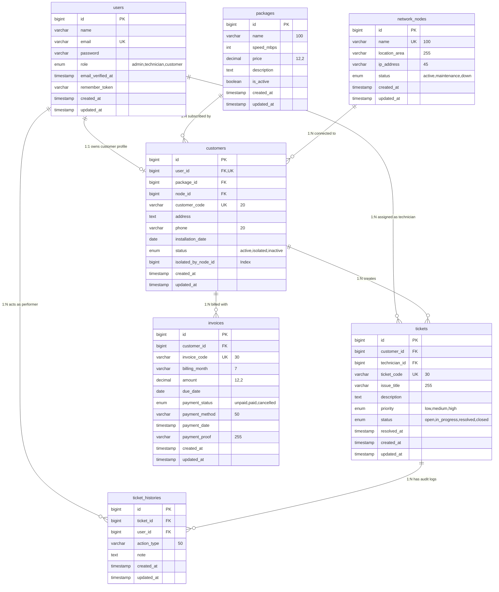

# Spesifikasi Skema Basis Data (Database Schema & Dictionary)

**Nama Produk:** NetInfo (Network Information & Operation Management System)  
**Database Engine:** MySQL 8.0+ / MariaDB 10.4+ (Storage Engine: **InnoDB**)  
**Karakter Enkoding & Collation:** `utf8mb4` / `utf8mb4_unicode_ci`  
**Versi Dokumen:** 1.0 (Final Database Blueprint)  

---

## 1. Diagram Hubungan Antar Entitas (Entity-Relationship Diagram / ERD)



---

## 2. Kamus Data Lengkap (Data Dictionary)

### 2.1. Tabel `users`
Tabel penyimpan kredensial otentikasi akun dan penetapan peran pengguna (*Role-Based Access Control*).

| Nama Kolom | Tipe Data | Nullable | Default | Keterangan & Constraint |
|---|---|:---:|:---:|---|
| `id` | BIGINT UNSIGNED | Tidak | Auto Increment | **Primary Key** |
| `name` | VARCHAR(255) | Tidak | - | Nama lengkap pengguna / administrator / teknisi |
| `email` | VARCHAR(255) | Tidak | - | **Unique**, alamat email untuk kredensial login |
| `password` | VARCHAR(255) | Tidak | - | Kata sandi terenkripsi hash (Bcrypt) |
| `role` | ENUM('admin','technician','customer') | Tidak | 'customer' | Peran pengguna dalam sistem |
| `email_verified_at` | TIMESTAMP | Ya | NULL | Waktu verifikasi email |
| `remember_token` | VARCHAR(100) | Ya | NULL | Token sesi "Ingat Saya" (*Remember Me*) |
| `created_at` | TIMESTAMP | Ya | NULL | Waktu akun dibuat |
| `updated_at` | TIMESTAMP | Ya | NULL | Waktu akun terakhir diperbarui |

---

### 2.2. Tabel `packages`
Tabel master paket layanan internet yang ditawarkan kepada pelanggan.

| Nama Kolom | Tipe Data | Nullable | Default | Keterangan & Constraint |
|---|---|:---:|:---:|---|
| `id` | BIGINT UNSIGNED | Tidak | Auto Increment | **Primary Key** |
| `name` | VARCHAR(100) | Tidak | - | Nama paket internet (contoh: "Home 20 Mbps") |
| `speed_mbps` | INT UNSIGNED | Tidak | - | Kecepatan bandwidth dalam Mbps (contoh: 20) |
| `price` | DECIMAL(12, 2) | Tidak | - | Tarif iuran bulanan dalam Rupiah (contoh: 250000.00) |
| `description` | TEXT | Ya | NULL | Deskripsi fitur dan keunggulan paket |
| `is_active` | BOOLEAN | Tidak | 1 (true) | Status ketersediaan paket untuk registrasi baru |
| `created_at` | TIMESTAMP | Ya | NULL | Waktu data dibuat |
| `updated_at` | TIMESTAMP | Ya | NULL | Waktu data terakhir diperbarui |

---

### 2.3. Tabel `network_nodes`
Tabel master infrastruktur titik distribusi jaringan / ODP (*Optical Distribution Point*).

| Nama Kolom | Tipe Data | Nullable | Default | Keterangan & Constraint |
|---|---|:---:|:---:|---|
| `id` | BIGINT UNSIGNED | Tidak | Auto Increment | **Primary Key** |
| `name` | VARCHAR(100) | Tidak | - | **Unique**, kode unik ODP (contoh: `ODP-BNA-01`) |
| `location_area` | VARCHAR(255) | Tidak | - | Nama wilayah dan alamat fisik sebaran ODP |
| `ip_address` | VARCHAR(45) | Ya | NULL | Alamat IPv4/IPv6 manajemen perangkat jaringan |
| `status` | ENUM('active','maintenance','down') | Tidak | 'active' | **Index**, status operasional node |
| `created_at` | TIMESTAMP | Ya | NULL | Waktu titik dibuat |
| `updated_at` | TIMESTAMP | Ya | NULL | Waktu titik terakhir diperbarui |

---

### 2.4. Tabel `customers`
Tabel data profil pelanggan yang terhubung dengan akun user, paket layanan, dan titik ODP.

| Nama Kolom | Tipe Data | Nullable | Default | Keterangan & Constraint |
|---|---|:---:|:---:|---|
| `id` | BIGINT UNSIGNED | Tidak | Auto Increment | **Primary Key** |
| `user_id` | BIGINT UNSIGNED | Tidak | - | **Foreign Key** $\to$ `users.id` (**Unique**, `ON DELETE CASCADE`) |
| `package_id` | BIGINT UNSIGNED | Tidak | - | **Foreign Key** $\to$ `packages.id` (`ON DELETE RESTRICT`) |
| `node_id` | BIGINT UNSIGNED | Ya | NULL | **Foreign Key** $\to$ `network_nodes.id` (`ON DELETE SET NULL`) |
| `customer_code` | VARCHAR(20) | Tidak | - | **Unique**, kode pelanggan sekuensial (`CUST-YYYYMM-XXXX`) |
| `address` | TEXT | Tidak | - | Alamat lengkap lokasi instalasi pelanggan |
| `phone` | VARCHAR(20) | Tidak | - | Nomor kontak WhatsApp / Telepon pelanggan |
| `installation_date` | DATE | Tidak | - | Tanggal pemasangan / aktivasi awal layanan |
| `status` | ENUM('active','isolated','inactive') | Tidak | 'active' | **Index**, status kelayakan layanan pelanggan |
| `isolated_by_node_id` | BIGINT UNSIGNED | Ya | NULL | **Index**, ID ODP penyebab isolasi otomatis (*Cascade Isolation*) |
| `created_at` | TIMESTAMP | Ya | NULL | Waktu registrasi pelanggan |
| `updated_at` | TIMESTAMP | Ya | NULL | Waktu profil pelanggan diperbarui |

---

### 2.5. Tabel `tickets`
Tabel pencatatan tiket komplain gangguan jaringan pelanggan (*Helpcare / Work Orders*).

| Nama Kolom | Tipe Data | Nullable | Default | Keterangan & Constraint |
|---|---|:---:|:---:|---|
| `id` | BIGINT UNSIGNED | Tidak | Auto Increment | **Primary Key** |
| `customer_id` | BIGINT UNSIGNED | Tidak | - | **Foreign Key** $\to$ `customers.id` (`ON DELETE CASCADE`) |
| `technician_id` | BIGINT UNSIGNED | Ya | NULL | **Foreign Key** $\to$ `users.id` (Teknisi bertugas, `ON DELETE SET NULL`) |
| `ticket_code` | VARCHAR(30) | Tidak | - | **Unique**, kode tiket sekuensial (`TICK-YYYYMMDD-XXXX`) |
| `issue_title` | VARCHAR(255) | Tidak | - | Subjek ringkas masalah / kendala jaringan |
| `description` | TEXT | Tidak | - | Rincian kronologi masalah yang dilaporkan pelanggan |
| `priority` | ENUM('low','medium','high') | Tidak | 'medium' | **Index**, tingkat urgensi penanganan |
| `status` | ENUM('open','in_progress','resolved','closed') | Tidak | 'open' | **Index**, status pengerjaan tiket gangguan |
| `resolved_at` | TIMESTAMP | Ya | NULL | Waktu penyelesaian perbaikan oleh teknisi |
| `created_at` | TIMESTAMP | Ya | NULL | Waktu pembuatan tiket |
| `updated_at` | TIMESTAMP | Ya | NULL | Waktu tiket terakhir dimutasi |

---

### 2.6. Tabel `ticket_histories`
Tabel jejak audit (*Audit Trail*) untuk merekam setiap interaksi, perubahan status, disposisi, dan log teknis perbaikan tiket.

| Nama Kolom | Tipe Data | Nullable | Default | Keterangan & Constraint |
|---|---|:---:|:---:|---|
| `id` | BIGINT UNSIGNED | Tidak | Auto Increment | **Primary Key** |
| `ticket_id` | BIGINT UNSIGNED | Tidak | - | **Foreign Key** $\to$ `tickets.id` (`ON DELETE CASCADE`) |
| `user_id` | BIGINT UNSIGNED | Tidak | - | **Foreign Key** $\to$ `users.id` (Aktor pelaku aksi, `ON DELETE CASCADE`) |
| `action_type` | VARCHAR(50) | Tidak | - | **Index**, tipe aksi (`created`, `assigned`, `status_changed`, `note_added`) |
| `note` | TEXT | Ya | NULL | Uraian catatan tindakan teknis / solusi / alasan |
| `created_at` | TIMESTAMP | Ya | NULL | Waktu kejadian dicatat |
| `updated_at` | TIMESTAMP | Ya | NULL | Waktu rekaman diperbarui |

---

### 2.7. Tabel `invoices`
Tabel transaksi penagihan bulanan, pencatatan bukti pembayaran, dan verifikasi status lunas pelanggan.

| Nama Kolom | Tipe Data | Nullable | Default | Keterangan & Constraint |
|---|---|:---:|:---:|---|
| `id` | BIGINT UNSIGNED | Tidak | Auto Increment | **Primary Key** |
| `customer_id` | BIGINT UNSIGNED | Tidak | - | **Foreign Key** $\to$ `customers.id` (`ON DELETE CASCADE`) |
| `invoice_code` | VARCHAR(30) | Tidak | - | **Unique**, kode faktur tagihan (`INV-YYYYMM-XXXX`) |
| `billing_month` | VARCHAR(7) | Tidak | - | **Index**, periode bulan tagihan format `YYYY-MM` (misal: `2026-08`) |
| `amount` | DECIMAL(12, 2) | Tidak | - | Nominal tagihan bulanan sesuai tarif paket |
| `due_date` | DATE | Tidak | - | Tanggal jatuh tempo pembayaran (tanggal 25 setiap bulannya) |
| `payment_status` | ENUM('unpaid','paid','cancelled') | Tidak | 'unpaid' | **Index**, status pembayaran tagihan |
| `payment_method` | VARCHAR(50) | Ya | NULL | Metode bayar yang dipilih pelanggan (`SeaBank Transfer`, `QRIS`) |
| `payment_date` | TIMESTAMP | Ya | NULL | Waktu invoice diverifikasi lunas oleh admin |
| `payment_proof` | VARCHAR(255) | Ya | NULL | Path lokasi berkas bukti transfer (`proofs/filename.ext`) |
| `created_at` | TIMESTAMP | Ya | NULL | Waktu invoice diterbitkan |
| `updated_at` | TIMESTAMP | Ya | NULL | Waktu invoice terakhir diperbarui |

---

## 3. Matriks Integritas Kunci & Indeks (Constraints & Indexing Matrix)

| Nama Tabel | Tipe Indeks / Constraint | Kolom Terlibat | Tujuan & Fungsi Bisnis |
|---|---|---|---|
| `users` | Primary Key | `id` | Pengidentifikasi unik baris |
| `users` | Unique Index | `email` | Menjamin 1 email hanya untuk 1 akun pengguna |
| `packages` | Primary Key | `id` | Pengidentifikasi unik baris |
| `network_nodes` | Primary Key | `id` | Pengidentifikasi unik baris |
| `network_nodes` | Unique Index | `name` | Mencegah duplikasi nama/kode ODP |
| `network_nodes` | Index | `status` | Mempercepat filter ODP (*active / maintenance / down*) |
| `customers` | Primary Key | `id` | Pengidentifikasi unik baris |
| `customers` | Unique Index | `user_id` | Relasi 1:1 antara akun User dan profil Pelanggan |
| `customers` | Unique Index | `customer_code` | Pengenal unik pelanggan (`CUST-YYYYMM-XXXX`) |
| `customers` | Foreign Key | `package_id` $\to$ `packages.id` | Menjaga referensi paket (`RESTRICT ON DELETE`) |
| `customers` | Foreign Key | `node_id` $\to$ `network_nodes.id` | Menjaga referensi ODP (`SET NULL ON DELETE`) |
| `customers` | Index | `status` | Mempercepat pencarian & filter pelanggan aktif/isolir |
| `customers` | Index | `isolated_by_node_id` | Mendukung kueri pemulihan otomatis saat ODP kembali *active* |
| `tickets` | Primary Key | `id` | Pengidentifikasi unik baris |
| `tickets` | Unique Index | `ticket_code` | Pengenal unik tiket (`TICK-YYYYMMDD-XXXX`) |
| `tickets` | Foreign Key | `customer_id` $\to$ `customers.id` | Pelapor tiket (`CASCADE ON DELETE`) |
| `tickets` | Foreign Key | `technician_id` $\to$ `users.id` | Teknisi penanggung jawab (`SET NULL ON DELETE`) |
| `tickets` | Index | `status`, `priority` | Optimasi penyaringan antrean tiket dan sorting |
| `tickets` | Composite Index | `status`, `technician_id` | Mempercepat kueri "Tiket Tugas Saya" pada panel teknisi |
| `ticket_histories`| Primary Key | `id` | Pengidentifikasi unik baris |
| `ticket_histories`| Foreign Key | `ticket_id` $\to$ `tickets.id` | Terhubung ke tiket terkait (`CASCADE ON DELETE`) |
| `ticket_histories`| Foreign Key | `user_id` $\to$ `users.id` | Terhubung ke pengguna pelaku aksi |
| `ticket_histories`| Index | `action_type` | Mempercepat analisis audit trail |
| `invoices` | Primary Key | `id` | Pengidentifikasi unik baris |
| `invoices` | Unique Index | `invoice_code` | Pengenal unik faktur tagihan (`INV-YYYYMM-XXXX`) |
| `invoices` | Composite Unique | `customer_id`, `billing_month` | **Mencegah terbitnya tagihan ganda** untuk pelanggan yang sama pada bulan yang sama |
| `invoices` | Foreign Key | `customer_id` $\to$ `customers.id` | Terhubung ke pelanggan (`CASCADE ON DELETE`) |
| `invoices` | Index | `billing_month`, `payment_status` | Mempercepat kalkulasi omzet bulanan & filter billing |

---

## 4. Standar Format Kode Transaksional (`App\Support\Codes`)

Sistem NetInfo menggunakan penomoran sekuensial yang konsisten dan terstandardisasi:

```
1. Format Kode Pelanggan:
   Prefix: CUST-YYYYMM-
   Contoh: CUST-202608-0001
   Logika: Mencari nomor urut 4 digit terakhir pada tabel customers di bulan berjalan, lalu ditambahkan 1.

2. Format Kode Tiket Gangguan:
   Prefix: TICK-YYYYMMDD-
   Contoh: TICK-20260825-0001
   Logika: Mencari nomor urut 4 digit terakhir pada tabel tickets di tanggal berjalan, lalu ditambahkan 1.

3. Format Kode Invoice / Faktur:
   Prefix: INV-YYYYMM-
   Contoh: INV-202608-0001
   Logika: Mencari nomor urut 4 digit terakhir pada tabel invoices di periode tagihan terkait, lalu ditambahkan 1.
```

---

## 5. Katalog Data Awal (*Seed & Reference Data*)

### 5.1. Akun Pengguna Utama (Admin & Teknisi)
* **Administrator 1:** Muhammad Ridha Rezeki (`muhammadridharezeki@gmail.com`) — *Role: Admin*
* **Administrator 2:** Rausyanul Fikri (`rosan@gmail.com`) — *Role: Admin*
* **Teknisi Lapangan 1:** Nabil Gathfan Putra Mulyana (`gatpan@gmail.com`) — *Role: Technician*
* **Teknisi Lapangan 2:** Ikhsan Salsabily (`isan@gmail.com`) — *Role: Technician*
* **Pelanggan Aktif:** 23 akun pelanggan sebaran wilayah Provinsi Aceh (Banda Aceh, Lhokseumawe, Aceh Utara, Bireuen, Pidie, dll.).

### 5.2. Master Paket Layanan Internet
1. **Home 10 Mbps:** Rp 150.000 / bulan (Kebutuhan dasar rumah tangga).
2. **Home 20 Mbps:** Rp 250.000 / bulan (Streaming HD & Work From Home).
3. **Home 50 Mbps:** Rp 450.000 / bulan (Keluarga banyak perangkat & gaming).
4. **Business 100 Mbps:** Rp 750.000 / bulan (Dedicated support + IP publik untuk usaha).

### 5.3. Master Titik Distribusi Jaringan (Network Nodes / ODP)
1. **`ODP-BNA-01`:** Jl. Tugu Adipura, Banda Aceh (IP: `10.10.1.1`, Status: `active`).
2. **`ODP-LSM-01`:** Jl. Sudirman, Lhokseumawe (IP: `10.10.1.2`, Status: `active`).
3. **`ODP-ATU-01`:** Jl. Merdeka, Lhoksukon, Aceh Utara (IP: `10.10.1.3`, Status: `maintenance`).
4. **`ODP-BIR-01`:** Perum Kota Bireuen Blok C (IP: `10.10.1.4`, Status: `active`).
5. **`ODP-PDE-01`:** Jl. Tgk. Daud Beureueh, Sigli, Pidie (Status: `down`).
